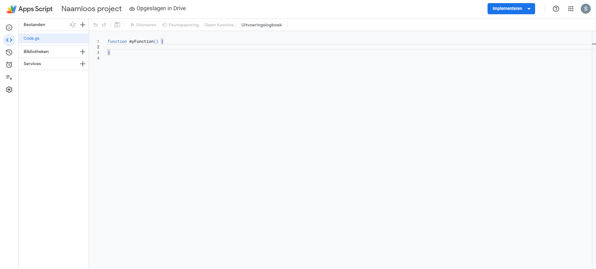
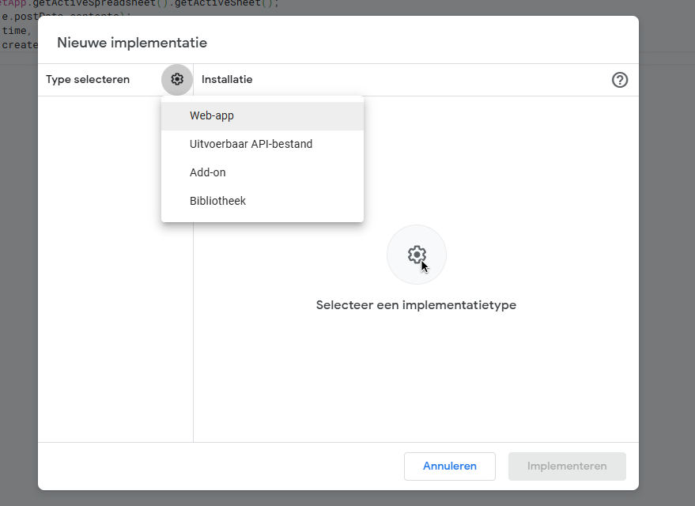
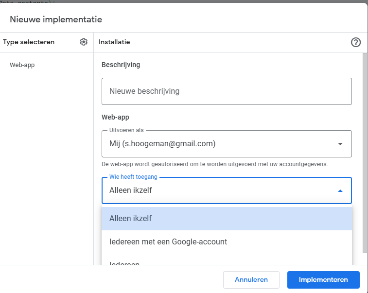
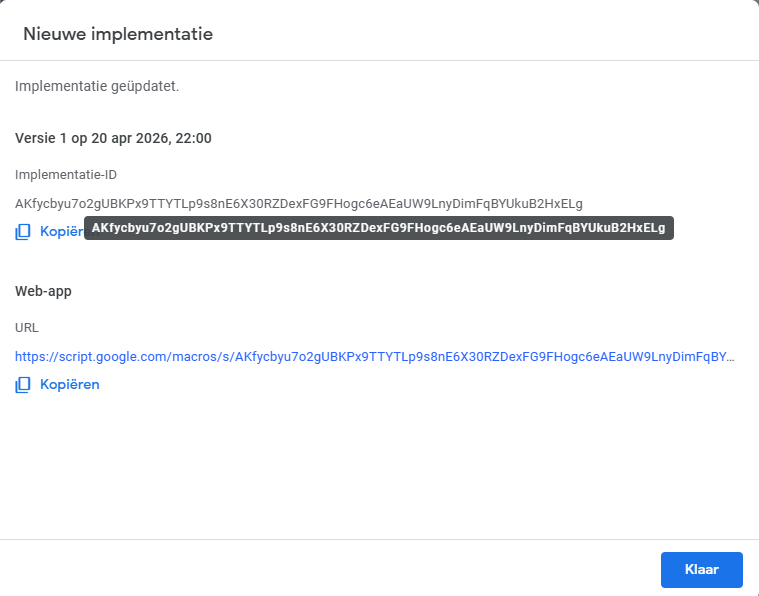

# Scale documentation
## Table of Contents
1. [calibration](#calibration)
2. [monitoring](#Wifi-setup)
3. [Third Example](#third-example)
4. [Fourth Example](#fourth-examplehttpwwwfourthexamplecom)

## calibration
For calibration of the scale [this sketch](calibration_sketch) can be used. 
This sketch will show the raw output of the [hx711](https://cdn.sparkfun.com/datasheets/Sensors/ForceFlex/hx711_english.pdf) board (scale) to the arduino, which can be used to calibrate the scale. 

The values found in the calibration have to be put into the following functions: 
1. [scale.set_offset()](scale_arduino/scale_arduino.inoscale_arduino.ino#L52) is used to set the zero weight off set. 
2. [scale.set_scale()](scale_arduino/scale_arduino.ino#L53) is used to set the scales gradient. 

## Remote monitoring
### setup of the google sheet 
The google sheets are connected using a app script, which listens for https posts. The setup is done by first creating a new sheet. Next open the appscripts by clicking on extensions followed by the appscript button. This leads you to the following screen . Copy paste the code given in [code.gs](AppScript/code.gs), save it and click on implement in the right corner followed by new implementation.  in this window select web app. 
 input a description (does not need a specific description) and change the access to everyone, which is very important. Next google will give some pop up you will have to allow everything. by clicking on advanced on the left side of the pop up. 
 Copy the web-app url and replace the [link](ESPV2/ESPV2.ino#L10)

To connect the esp8266 to wifi change the [ssid and password](ESPV2/ESPV2.ino#L12-13) 